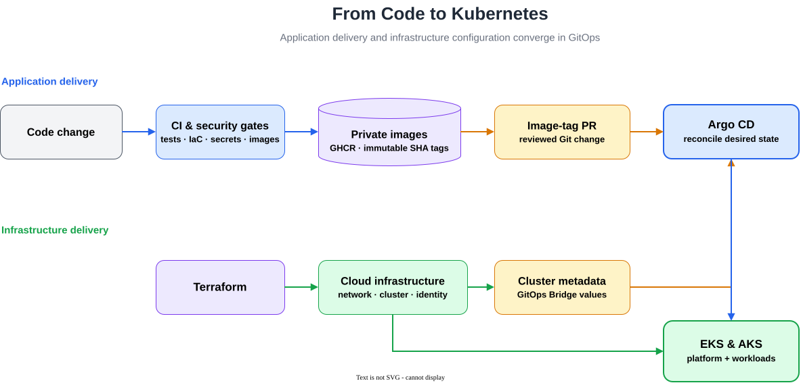

# Microservices Kubernetes Platform

A production-inspired platform engineering project that delivers the same
microservices application to AWS EKS and Azure AKS.

I built the infrastructure, delivery pipelines, Helm charts, GitOps platform,
cloud integrations, security controls, and operational documentation. The
application workload is based on Google's
[Online Boutique](https://github.com/GoogleCloudPlatform/microservices-demo),
which provides a realistic system of 11 communicating services on which to
build and operate the platform.

## What This Project Demonstrates

- **Infrastructure as Code:** reproducible, multi-zone EKS and AKS environments
  with private worker nodes and controlled egress
- **Cloud networking:** automated load balancing, DNS, and HTTPS on both cloud
  platforms
- **GitOps delivery:** Argo CD app-of-apps deployment of platform components,
  workloads, and observability
- **Operations:** persistent storage, workload and node autoscaling,
  observability, and automated environment teardown
- **Secure identity:** GitHub Actions OIDC, EKS Pod Identity, and Azure Workload
  Identity instead of long-lived cloud credentials
- **Secret management:** private GHCR credentials synchronized from AWS Secrets
  Manager and Azure Key Vault by External Secrets Operator
- **Workload security:** non-root containers, read-only root filesystems,
  restricted Linux capabilities, seccomp profiles, and service-aware
  NetworkPolicies
- **Security scanning:** Trivy scans dependencies, secrets, infrastructure
  configuration, Dockerfiles, rendered manifests, and container images

## Delivery Flow



Application changes pass CI and security gates in GitHub Actions. Trivy scans
the repository, infrastructure configuration, rendered manifests, secrets, and
container images. Images that pass are published to GHCR with immutable
commit-SHA tags, and an automated pull request updates the Helm values.
Terraform provisions the cloud infrastructure, while Argo CD continuously
reconciles the in-cluster platform and workloads.

Terraform outputs such as cluster identifiers, identity client IDs, DNS data,
and certificate references reach the Helm charts through GitOps Bridge cluster
metadata. Environment-specific infrastructure values therefore do not need to
be committed to Git.

## Cloud Platform Comparison

| Capability | AWS | Azure |
| --- | --- | --- |
| Cluster | EKS | AKS |
| Provisioning | Terraform | Terraform |
| GitOps | Argo CD | Argo CD |
| Workload packaging | Helm | Helm |
| Private image access | Secrets Manager + External Secrets | Key Vault + External Secrets |
| Controller identity | EKS Pod Identity | Azure Workload Identity |
| Public traffic | Application Load Balancer | Application Gateway for Containers |
| DNS and TLS | Route 53 + ACM | Azure DNS + cert-manager |
| Persistent storage | EBS CSI | Azure Disk CSI |

## Key Engineering Decisions

### Terraform provisions; Argo CD operates

Terraform owns cloud infrastructure and the initial Argo CD bootstrap. Argo CD
then owns Kubernetes resources and controller deployments. This keeps cloud
provisioning separate from continuous in-cluster reconciliation.

### Cloud metadata crosses the boundary explicitly

Terraform outputs are passed to Argo CD through a cluster metadata Secret.
ApplicationSets translate that metadata into Helm values, connecting resources
such as identities, subnets, DNS zones, certificates, and secret stores without
duplicating them in static configuration.

### Secrets remain outside Git

GHCR credentials are stored in each cloud's managed secret service. External
Secrets Operator creates the Kubernetes pull Secret at runtime.

### Cloud environments are disposable

Protected GitHub Actions workflows create, update, and tear down EKS and AKS.
The teardown order allows Argo CD and Kubernetes controllers to remove their
cloud-managed resources before Terraform destroys the underlying environment.

## Validation

The cloud platform has been deployed and verified on both EKS and AKS. The
validation covers:

- CI tests, Helm linting, rendered-manifest validation, and Trivy security gates
- Argo CD synchronization and self-healing
- private GHCR image pulls through each environment's secret-management path
- persistent storage and autoscaling
- public DNS, HTTP-to-HTTPS redirection, and HTTPS access on EKS and AKS
- controlled cloud-environment teardown

The application and GitOps structure can also be deployed locally with Rancher
Desktop for development and Helm chart validation.

## Explore the Implementation

| Area | Start here |
| --- | --- |
| CI, image publishing, and GitOps updates | [CI/CD guide](docs/ci.md) |
| AWS infrastructure and platform | [EKS guide](docs/eks.md) |
| Azure infrastructure and platform | [AKS guide](docs/aks.md) |
| Local Helm and Argo CD deployment | [Local guide](docs/local.md) |
| Monitoring and alerting | [Observability guide](docs/observability.md) |
| Security controls | [Security guide](docs/security.md) |
| Completed milestones and roadmap | [Project plan](PROJECT.md) |

## Repository Layout

```text
src/                 Microservices source code
helm/                Application, platform, and observability charts
argocd/              App-of-apps roots, Applications, and bootstrap metadata
terraform/           AWS and Azure infrastructure
.github/workflows/   Application CI and protected cloud lifecycle pipelines
docs/                Platform guides and architecture diagrams
```

## Attribution

The application workload is based on Google's
[Online Boutique](https://github.com/GoogleCloudPlatform/microservices-demo),
licensed under Apache 2.0. The Kubernetes platform implementation in this
repository was built around that workload as an independent learning and
portfolio project.
