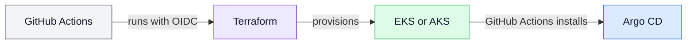
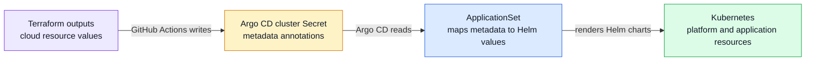
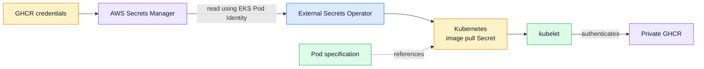
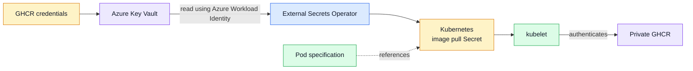
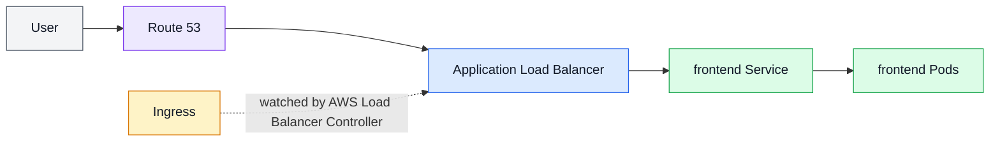
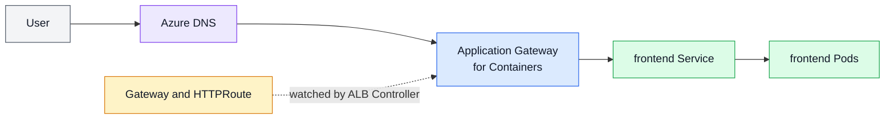

# Platform Architecture Flows

These five flows explain how application code, cloud infrastructure, dynamic
configuration, credentials, and user traffic move through the platform.

## 1. Application Delivery

```mermaid
flowchart LR
    code["Code change"] --> ci["CI and security gates"]
    ci --> images["Private GHCR images<br/>immutable SHA tags"]
    images --> pr["Automated image-tag PR"]
    pr --> merge["Reviewed merge"]
    merge --> argo["Argo CD reconciliation"]
    argo --> workloads["EKS and AKS workloads"]

    classDef source fill:#f3f4f6,stroke:#4b5563,color:#111827
    classDef delivery fill:#dbeafe,stroke:#2563eb,color:#111827
    classDef artifact fill:#ede9fe,stroke:#7c3aed,color:#111827
    classDef review fill:#fef3c7,stroke:#d97706,color:#111827
    classDef runtime fill:#dcfce7,stroke:#16a34a,color:#111827
    class code source
    class ci,argo delivery
    class images artifact
    class pr,merge review
    class workloads runtime
```

Pull requests run validation without publishing images. After a change reaches
`main`, the workflow publishes the affected images and opens a separate,
reviewable Helm image-tag pull request. Argo CD deploys only after that pull
request is merged.

## 2. Infrastructure Provisioning

GitHub Actions authenticates to each cloud without stored cloud credentials.
Terraform provisions the network, cluster, identities, and edge resources. The
workflow then bootstraps Argo CD. The cloud CLI configures administrator access
to the resulting cluster when operational inspection is needed.

## 3. GitOps Bridge

Terraform exposes values that can only be known after provisioning, such as
identity IDs, subnet IDs, DNS metadata, certificate references, and the Key
Vault URI. GitHub Actions writes those outputs into the environment's Argo CD
cluster Secret as metadata annotations.

The Argo CD ApplicationSet maps those annotations to Helm parameters. Argo CD
then renders the charts and reconciles the resulting platform and application
resources without committing environment-specific values to Git.

## 4. Secret Delivery

### AWS

### Azure

In both clouds, the credential stays outside Git and Terraform state. External
Secrets Operator uses the environment's workload identity to read it and create
a Docker registry Secret. The Secret is not mounted into the application
container; kubelet uses it to authenticate when pulling the private image.

## 5. Request Path

### AWS

### Azure

The solid lines show the request path. The dashed lines show the Kubernetes
resources that controllers reconcile into cloud load-balancing configuration.
Both environments terminate HTTPS at the managed edge and route traffic to the
frontend Service.
