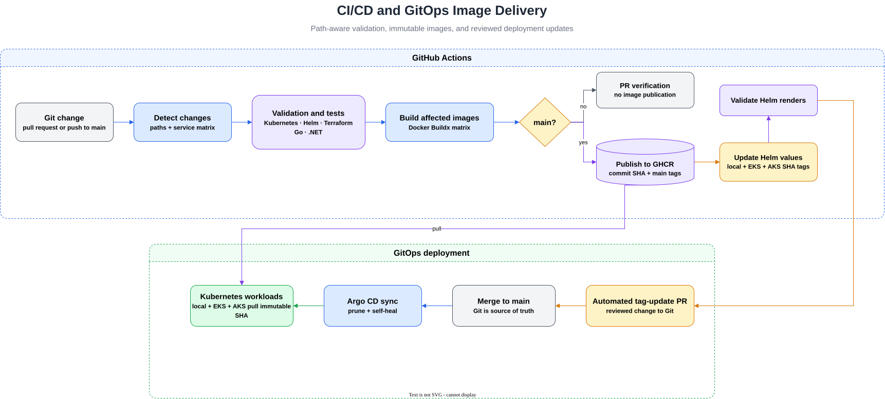

# CI/CD Pipeline

The GitHub Actions workflow in `.github/workflows/ci.yml` validates changes,
builds affected service images, publishes them to GHCR, and opens GitOps image
tag update pull requests.

It runs for pull requests and pushes to `main`.

## Delivery Flow



## Path-Aware Validation

`detect-changes` prevents unrelated jobs from running while workflow changes
intentionally exercise every job.

| Area | Validation |
| --- | --- |
| Kubernetes | kubeconform for rendered Helm and Argo CD applications |
| Helm | lint, dependency build, render, and kubeconform for both charts |
| Go | `go test ./...` matrix for deployed Go services |
| .NET | `dotnet test` for cartservice |

Custom-resource schemas are supplied to kubeconform for the AWS platform and
Argo CD resources. Cloud-specific workflows validate and plan Terraform using
OIDC and remote state.

The Go matrix covers checkout, frontend, product catalog, and shipping. These
commands also compile their packages. Other upstream services currently have
no meaningful test suites, so CI does not pretend that placeholder test
commands provide coverage.

## Container Image Pipeline

Only deployed services whose source paths changed are included in the image
matrix. A workflow change builds every image.

```text
pull request
  -> validation and tests
  -> build affected images
  -> scan images with Trivy

push to main
  -> validation and tests
  -> build affected images
  -> scan images with Trivy
  -> publish images that pass
  -> update immutable Helm tags
  -> open automated pull request
```

Images are published as:

```text
ghcr.io/micheleformenti/<service>:<git-sha>
```

The SHA tag is immutable by convention and is used by deployments for an
explicit, reproducible version.

The packages are private. Local Kubernetes uses a manually bootstrapped pull
Secret, while EKS and AKS use External Secrets Operator to synchronize the
credential from their cloud secret stores. Redis and BusyBox continue to use
their upstream images.

## GitOps Image Updates

After publishing from `main`, the workflow updates only the services that were
built in:

- `helm/application/values-local.yaml`
- `helm/application/values-eks.yaml`
- `helm/application/values-aks.yaml`

All three files receive the new commit SHA. Helm renders are validated before the
workflow opens a pull request. The workflow never commits deployment changes
directly to `main`.

The generated pull request does not rebuild images because it changes only Helm
values. It still runs the relevant Kubernetes and Helm validation before merge.

## Local GHCR Smoke Test

The same immutable images can be tested locally:

```sh
helm upgrade --install microservices-platform ./helm/application \
  --namespace microservices-platform \
  --create-namespace \
  -f helm/application/values.yaml \
  -f helm/application/values-local.yaml
```
