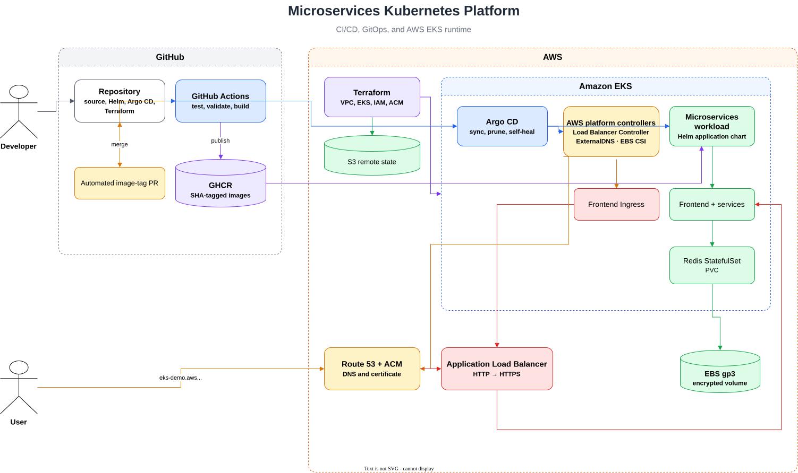
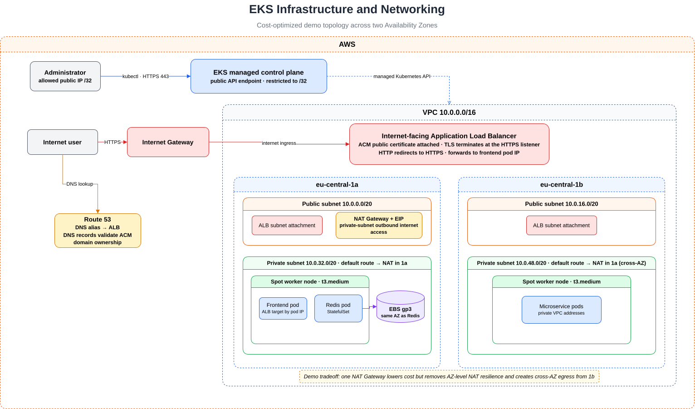

# AWS EKS Platform

This guide covers Terraform infrastructure, GitOps delivery, persistent Redis
storage, autoscaling, and public HTTPS access on EKS.

The platform was validated end to end on EKS, including remote Terraform state,
GitOps reconciliation, EBS persistence, an Application Load Balancer, ACM TLS,
Route 53 records managed by ExternalDNS, and pod and node autoscaling.

## Architecture



Worker nodes run in private subnets across two Availability Zones and use NAT
for outbound access. Public subnets host internet-facing load balancers. The EKS
API is public but restricted to a configured CIDR.

## Ownership Boundaries

Terraform manages resources that must exist before Kubernetes controllers:

- VPC, EKS, managed nodes, addons, and cluster access
- S3 remote state
- ACM certificate and DNS validation
- IAM policies, roles, and EKS Pod Identity associations

The AWS root Application creates three child Applications:

- `helm/platform/aws`: AWS controllers and storage configuration
- `helm/application`: shared workload with EKS value overrides
- `helm/observability`: Prometheus and Grafana

The controllers manage resources discovered at runtime:

- AWS Load Balancer Controller: Ingress to ALB
- ExternalDNS: Ingress hostname to Route 53 records
- EBS CSI driver: PVC to EBS volume
- Metrics Server: pod resource metrics for the HPA
- Cluster Autoscaler: pending pods to managed node group capacity

This avoids feeding dynamic values such as the ALB hostname back into
Terraform.

## Infrastructure Decisions

The configuration uses pinned community VPC and EKS Terraform modules. This
keeps the infrastructure reproducible while the project remains focused on
Kubernetes platform delivery.

Demo defaults start with two `t3.medium` Spot nodes and allow the managed node
group to scale between one and four nodes. One shared NAT Gateway reduces cost
but is less resilient than on-demand capacity and one NAT Gateway per
Availability Zone. The environment is intended to be destroyed when it is not
being demonstrated.



## Provision the Cluster

### Remote state

`terraform/aws/bootstrap` creates an encrypted, versioned S3 bucket with public
access blocked. It keeps local state because it creates the remote backend
itself.

```sh
terraform -chdir=terraform/aws/bootstrap init
terraform -chdir=terraform/aws/bootstrap apply
terraform -chdir=terraform/aws/bootstrap output -raw state_bucket_name
```

Create the ignored backend configuration, replace its account placeholder, and
initialize the EKS root:

```sh
cp terraform/aws/eks/backend.hcl.example terraform/aws/eks/backend.hcl
terraform -chdir=terraform/aws/eks init -backend-config=backend.hcl
```

State is stored at `microservices-platform/eks/terraform.tfstate` with native S3
lockfiles. The bucket is retained between temporary cluster runs.

### EKS environment

Create `terraform.tfvars` from the example. Restrict the public API endpoint to
your current IP and configure the existing hosted zone and application domain.

```hcl
cluster_endpoint_public_access_cidrs = ["YOUR_PUBLIC_IP/32"]
```

Validate and provision:

```sh
terraform fmt -check -recursive terraform/aws
terraform -chdir=terraform/aws/eks validate
terraform -chdir=terraform/aws/eks plan
terraform -chdir=terraform/aws/eks apply

aws eks update-kubeconfig \
  --region eu-central-1 \
  --name microservices-platform-eks

kubectl get nodes
```

If the API later times out, verify that the configured `/32` still matches your
public IP.

## Deploy with Argo CD

Install Argo CD and apply only the AWS root Application:

```sh
helm repo add argo https://argoproj.github.io/argo-helm
helm upgrade --install argocd argo/argo-cd \
  --namespace argocd \
  --create-namespace

kubectl apply -f argocd/roots/aws.yaml
```

The root creates three children that track `main` with automated sync, pruning,
and self-healing:

```text
aws-platform      -> helm/platform/aws -> kube-system
aws-workload      -> helm/application  -> microservices-platform
aws-observability -> helm/observability -> monitoring
```

```sh
kubectl get applications -n argocd
kubectl get pods -n kube-system
kubectl get pods -n microservices-platform
```

## Persistent Redis Storage

Redis runs as a `StatefulSet`. Local values use `emptyDir`; EKS values enable a
`volumeClaimTemplates` block requesting the `gp3` StorageClass.

```text
redis-cart-0 -> PVC -> gp3 StorageClass -> EBS CSI driver -> encrypted EBS
```

`WaitForFirstConsumer` provisions the volume in the pod's Availability Zone.
Deleting the pod preserves its PVC, so the replacement mounts the same data.
Deleting the PVC removes the EBS volume because the reclaim policy is `Delete`.

```sh
kubectl get statefulset redis-cart -n microservices-platform
kubectl get pvc -n microservices-platform
kubectl get pv
```

This demonstrates persistence, not highly available Redis. EBS is
Availability-Zone-bound; production would require Redis replication or a
managed multi-AZ service.

## Pod and Node Autoscaling

Metrics Server supplies CPU metrics to an HPA that scales the frontend between
one and three replicas at a 60% target. Cluster Autoscaler uses a matching
Kubernetes version and EKS Pod Identity to resize the tagged node group within
its configured minimum and maximum.

Validated with temporary load:

```text
traffic -> frontend HPA: 1 -> 3 -> 1 replicas
pending CPU request -> managed node group: 3 -> 4 -> 3 nodes
```

```sh
kubectl get hpa frontend -n microservices-platform
kubectl get nodes
kubectl logs -n kube-system deployment/aws-platform-aws-cluster-autoscaler
```

HPA scale-down is stabilized; Cluster Autoscaler waits about ten minutes before
removing an unneeded node.

Reproduce the test by adding application load, then requesting more CPU than
the current nodes can schedule:

```sh
LOAD_IMAGE=$(kubectl get deployment loadgenerator -n microservices-platform \
  -o jsonpath='{.spec.template.spec.containers[0].image}')

kubectl run hpa-load-test -n microservices-platform \
  --image="$LOAD_IMAGE" --restart=Never \
  --env=FRONTEND_ADDR=frontend:80 --env=USERS=200 --env=RATE=10

kubectl create deployment ca-load-test --image=registry.k8s.io/pause:3.10
kubectl set resources deployment ca-load-test \
  --requests=cpu=1500m,memory=128Mi
```

Watch `kubectl get hpa frontend -n microservices-platform --watch` and
`kubectl get nodes --watch`, then clean up:

```sh
kubectl delete pod hpa-load-test -n microservices-platform
kubectl delete deployment ca-load-test
```

## ALB, HTTPS, and DNS

The frontend remains a `ClusterIP`. Its Ingress uses ALB `target-type: ip`, so
the load balancer routes directly to pod IPs.

Terraform creates a DNS-validated ACM certificate. The Ingress declares the
same hostname and HTTP/HTTPS listeners, allowing the Load Balancer Controller
to discover and attach the certificate without hardcoding its ARN. TLS
terminates at the ALB, and HTTP is redirected to HTTPS.

ExternalDNS creates the Route 53 alias after the ALB exists. It is restricted
to `aws.micheleformenti.com`, has IAM access only to that hosted zone, and uses
TXT ownership with `sync` policy. This resolves the dependency problem between
Terraform and the controller-created ALB.

Verify the complete path:

```sh
kubectl get ingress frontend -n microservices-platform
kubectl logs -n kube-system deployment/aws-platform-external-dns
dig eks-demo.aws.micheleformenti.com
curl -I http://eks-demo.aws.micheleformenti.com
curl -I https://eks-demo.aws.micheleformenti.com
```

The HTTP request should redirect to HTTPS. Route 53 should contain the
application alias and an ExternalDNS ownership TXT record.

## Teardown

Order matters because the controllers must clean up their AWS resources. Delete
the root first so it cannot recreate its children:

```sh
kubectl delete -f argocd/roots/aws.yaml
argocd app delete aws-observability --cascade --yes
argocd app delete aws-workload --cascade --yes
```

Wait for ExternalDNS to remove its records and for the Load Balancer Controller
to delete the ALB. Confirm that the application PVC and its EBS volume are also
gone before removing the platform and cluster:

```sh
kubectl get ingress,pvc -A
kubectl get pv
```

Then remove the platform and cluster:

```sh
argocd app delete aws-platform --cascade --yes
helm uninstall argocd -n argocd
kubectl delete namespace argocd
terraform -chdir=terraform/aws/eks destroy
```

Confirm that NAT Gateways, nodes, load balancers, and EBS volumes are gone. The
existing hosted zone is read, not owned, by this Terraform root. Keep the
bootstrap state bucket for future runs.
